# gitlab-ci-cd-templates

[](http://github.com/hhyo/archery/blob/master/LICENSE)

## 版本依赖

gitlab community edition  12.2.5

## 说明

基于gitlab CI/CD实现基于python3.7+、maven、nodejs开发应用从单元测试、构建到部署的全过程自动化。

### 使用

参照examples下的用例。


 # 功能概述

提供代码质量自动检查机制（详细方案设计请见新CI方案）。


1.工程master或dev分支代码变更触发CI流程自动执行（粒度为服务级别，如merge请求同时修改了user及general，则整个CI流程仅针对user于general应用进行）；

2.CI流程依次为： 【静态代码检查】--> 【编译代码】-->  【执行单元测试】--> 【输出覆盖率报告】;

3.主要输出包括代码质量分析、覆盖率详细报告及图表形式的覆盖率分析。

# 项目上线示例

## CI模板讲解

注：此处指讲解java项目模板。

1）申明采用的docker镜像

image: maven:3.6.2-jdk-8

2）申明ci/cd全局变量

```

variables:
 MAVEN_CLI_OPTS: "-s /root/.m2/settings.xml --batch-mode"
 MAVEN_OPTS: "-Dmaven.repo.local=/root/.m2/repository"
 POM_PATH: "backend/user"
 GIT_CLEAN_FLAGS: "none"
 GIT_DEPTH: "3"
 PRO_NAME: "$CI_PROJECT_NAMESPACE/$CI_PROJECT_NAME"
 SONAR_TOKEN: "$SONAR_LOGIN"
 SONAR_HOST_URL: "$SONAR_URL"
 SONAR_NAME: "$SONAR_NAME"

```

3）申明全局缓存

```
cache:
 paths:
 - /root/.m2/repository/
 - $POM_PATH/target/
```

4）定义预操作

```
before_script:
 - |
 echo 'deb http://mirrors.163.com/debian/ stretch main non-free contrib
 deb http://mirrors.163.com/debian/ stretch-updates main non-free contrib
 deb http://mirrors.163.com/debian/ stretch-backports main non-free contrib
 deb-src http://mirrors.163.com/debian/ stretch main non-free contrib
 deb-src http://mirrors.163.com/debian/ stretch-updates main non-free contrib
 deb-src http://mirrors.163.com/debian/ stretch-backports main non-free contrib
 deb http://mirrors.163.com/debian-security/ stretch/updates main non-free contrib
 deb-src http://mirrors.163.com/debian-security/ stretch/updates main non-free contrib' > /etc/apt/sources.list
 - apt update
 - apt-get install -y mysql-client
 - pwd
 - |
 echo '<?xml version="1.0" encoding="UTF-8"?>
 <settings xsi:schemaLocation="http://maven.apache.org/SETTINGS/1.1.0 http://maven.apache.org/xsd/settings-1.1.0.xsd" xmlns="http://maven.apache.org/SETTINGS/1.1.0"
 xmlns:xsi="http://www.w3.org/2001/XMLSchema-instance">
 <servers>
 <server>
 <username>admin</username>
 <password>APAK1MQcXFpiDLyP</password>
 <id>central</id>
 </server>
 <server>
 <username>admin</username>
 <password>APAK1MQcXFpiDLyP</password>
 <id>snapshots</id>
 </server>
 </servers>
 <profiles>
 <profile>
 <repositories>
 <repository>
 <snapshots>
 <enabled>false</enabled>
 </snapshots>
 <id>central</id>
 <name>libs-release</name>
 <url>http://10.28.204.14:9099/artifactory/libs-release</url>
 </repository>
 <repository>
 <id>snapshots</id>
 <name>libs-snapshot</name>
 <url>http://10.28.204.14:9099/artifactory/libs-snapshot</url>
 <snapshots>
 <enabled>true</enabled>
 <updatePolicy>always</updatePolicy>
 </snapshots>
 </repository>
 </repositories>
 <pluginRepositories>
 <pluginRepository>
 <snapshots>
 <enabled>false</enabled>
 </snapshots>
 <id>central</id>
 <name>libs-release</name>
 <url>http://10.28.204.14:9099/artifactory/libs-release</url>
 </pluginRepository>
 <pluginRepository>
 <snapshots />
 <id>snapshots</id>
 <name>libs-snapshot</name>
 <url>http://10.28.204.14:9099/artifactory/libs-snapshot</url>
 </pluginRepository>
 </pluginRepositories>
 <id>artifactory</id>
 </profile>
 </profiles>
 <activeProfiles>
 <activeProfile>artifactory</activeProfile>
 </activeProfiles>
 
 </settings>' > /root/.m2/settings.xml
```

注：此处配置系统国内更新源及私有maven仓库配置、mysql客户端部署。

5）定义代码检查job（借助sonarqube实现）

```
.sonarqube_job:
 stage: static_analysis
 variables:
 POM_PATH: "backend/user"
 script:
 - mvn -f $POM_PATH/pom.xml -Dsonar.projectKey=$SONAR_NAME -Dsonar.host.url=$SONAR_HOST_URL -Dsonar.login=$SONAR_TOKEN verify sonar:sonar
 only:
 - merge_requests
 - branches
 allow_failure: true
```

6）定义单元测试job

```
.unit_test:
 stage: unit_test
 variables:
 POM_PATH: "backend/user"
 APP_NAME: "user"
 PRO_NAME: "$CI_PROJECT_NAMESPACE/$CI_PROJECT_NAME"
 before_script:
 script:
 - mvn $MAVEN_CLI_OPTS -f $POM_PATH/pom.xml test
 - cat $POM_PATH/target/site/jacoco/index.html
 after_script:
 - cat $POM_PATH/target/site/jacoco/index.html|grep -Eo "Total.*?([0-9]{1,3})%"|grep -Eo "([0-9]{1,3})%"|grep -Eo "([0-9]{1,3})"|head -n 1
 - COVER_VAL=`cat $POM_PATH/target/site/jacoco/index.html|grep -Eo "Total.*?([0-9]{1,3})%"|grep -Eo "([0-9]{1,3})%"|grep -Eo "([0-9]{1,3})"| head -n 1`
 - echo "coverage value is $COVER_VAL"
 - echo "debug sql:\n insert into coverage_report (app_name,project_path,branch_or_tag,commit_id,ci_job_id,coverage_value) values(\"$APP_NAME\", \"$PRO_NAME\", \"$CI_COMMIT_REF_NAME\", \"$CI_COMMIT_SHORT_SHA\", \"$CI_JOB_ID\", $COVER_VAL);commit;"
 - mysql -h $MYSQL_HOST -u $MYSQL_USER -D $MYSQL_DATABASE -p$MYSQL_PASSWORD -e "insert into $MYSQL_TABLE (app_name,project_path,branch_or_tag,commit_id,ci_job_id,coverage_value) values(\"$APP_NAME\", \"$PRO_NAME\", \"$CI_COMMIT_REF_NAME\", \"$CI_COMMIT_SHORT_SHA\", \"$CI_JOB_ID\", $COVER_VAL);commit;"
 only:
 changes:
 - backend/user/*
 refs:
 - tech-4.2.0
 - merge_requests
 - master
 - tags
 allow_failure: true
```

7）覆盖率报告上传job

```
.pages:
 stage: unit_test
 variables:
 POM_PATH: "backend/user"
# dependencies:
# - .unit_test
 script:
 - mkdir -p public/$POM_PATH/
 - cp -r $POM_PATH/target/site/jacoco/* public/$POM_PATH/
 only:
 changes:
 - backend/user/*
 artifacts:
 paths:
 - public
 expire_in: 30 days
 allow_failure: true
```

8）制作并上传镜像到仓库

```
.build_image:
 stage: build_image
 image:
 name: tezign.com:5000/kaniko-executor:debug
 entrypoint: [""]
 before_script:
 - |
 echo "
 {
 "auths":
 {
 "$CI_REGISTRY":
 {
 "username": "$CI_REGISTRY_USER",
 "password": "$CI_REGISTRY_PASSWORD"
 }
 },
 }" > /kaniko/.docker/config.json
 - |
 echo "$REGISTRY_CERT" >> /kaniko/ssl/certs/ca-certificates.crt
 - echo "10.28.204.14 tezign.com" >> /etc/hosts
 - |
 echo "
 {
 "registry-mirrors": [
 "https://15gvlmjd.mirror.aliyuncs.com"
 ],
 "insecure-registries": [
 "tezign.com"
 ],
 "bip":"192.168.0.1/24"
 }" >> /kaniko/.docker/daemon.json
 - if [[ $CI_COMMIT_TAG ]];then echo "image $CI_REGISTRY_IMAGE:$CI_COMMIT_TAG";fi
 - if [[ $CI_COMMIT_TAG == "" ]];then echo "$CI_REGISTRY_IMAGE:latest";fi
 script:
 - if [[ $CI_COMMIT_TAG ]] && [[ $CI_COMMIT_TAG != "latest" ]];then /kaniko/executor --context $(pwd)/$CI_PROJECT_DIR --dockerfile $CI_PROJECT_DIR/Dockerfile --destination $CI_REGISTRY_IMAGE:$CI_COMMIT_TAG --skip-tls-verify-registry $CI_REGISTRY;fi
 - /kaniko/executor --context $(pwd)/$CI_PROJECT_DIR --dockerfile $CI_PROJECT_DIR/Dockerfile --destination $CI_REGISTRY_IMAGE:latest --skip-tls-verify-registry $CI_REGISTRY
 only:
 refs:
 - master
```

## 项目变量配置

进入项目【设置】-【CI/CD】-【变量】

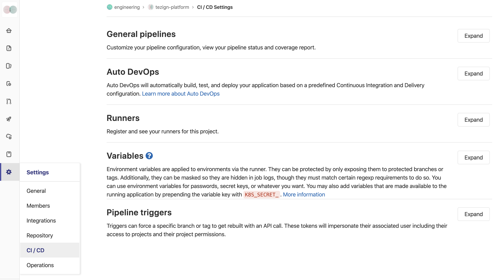

## 定义变量

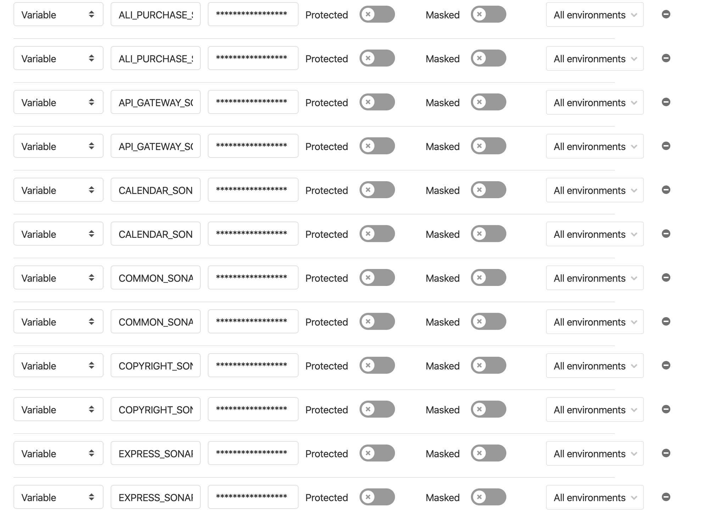

## 项目CI设置

进入项目【设置】-【CI/CD】-【通用 pipelines】。

1）触发pipeline代码行为定义，一般默认fetch即可。建议开启浅拷贝，值在1-5之间。

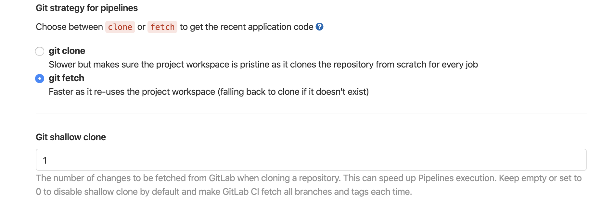

2）Timeout最好做自定义（15-30m之间？），否则出现异常可能会导致合并代码等操作挂起。

3）.gitlab-ci.yml位置，保持默认值即可。

4）覆盖率正则表达式，建议拷贝项目开发语言对应推荐正则即可。

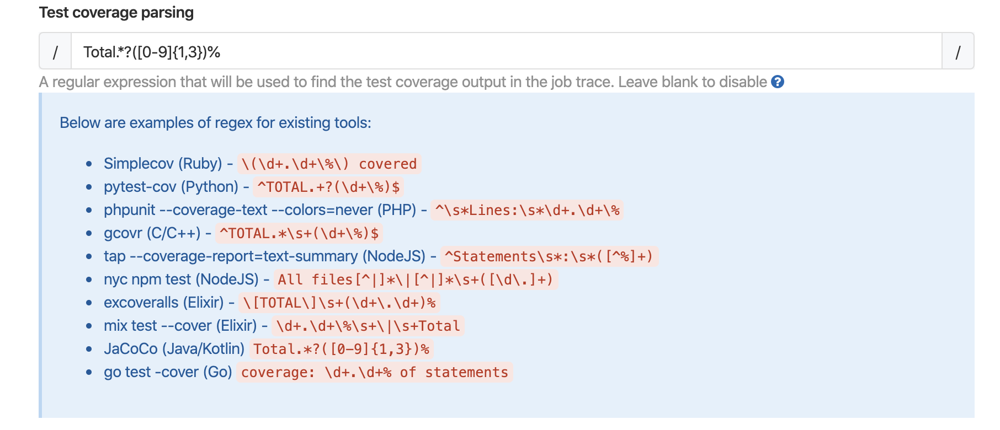

5）pipeline状态及覆盖率结果badge，选择对应分支，将markdown格式的链接贴到readme即可。

## 项目.gitlab-ci.yml配置

实际上此处仅仅是对模板简单的重用，对pipeline各个job个性化的部分进行重载。

1）引用模板

```
include:
 project: 'tezign_dev/ci-templates'
 ref: master
 file: '/templates/.gitlab-ci-maven-template.yml'
```

2）申明全局变量

```
variables:
 GIT_DEPTH: "1"
 GIT_CLEAN_FLAGS: "none"
 MYSQL_HOST: "127.0.0.1"
 MYSQL_DATABASE: "unit_test"
 MYSQL_USER: "test"
 MYSQL_PASSWORD: "123456"
```

3）静态代码检查

重载模板中名为.sonarqube_job的job即可，差异化的点在于pom文件路径、sonarqube项目配置这几个变量值不同，以及代码路径不同，还有就是触发job的场景可能不同。

```
static_portfolio:
 variables:
 POM_PATH: "backend/portfolio"
 SONAR_NAME: "$PORTFOLIO_SONAR_PRO"
 SONAR_TOKEN: "$PORTFOLIO_SONAR_TOKEN"
 extends:
 .sonarqube_job
 only:
 refs:
 - merge_requests
 changes:
 - backend/portfolio/*
```

4）编译

重载模板中名为.build的job即可，差异化的点在于pom文件路径变量值不同，以及代码路径不同，还有就是触发job的场景可能不同。

```
build_portfolio:
 variables:
 POM_PATH: "backend/portfolio"
 extends:
 .build
 only:
 refs:
 - merge_requests
 changes:
 - backend/portfolio/*
```

5）单元测试

重载模板中名为.unit_test的job即可，差异化的点在于pom文件路径变量值不同，以及代码路径不同，还有就是触发job的场景可能不同。

```
test_top2:
 variables:
 POM_PATH: "backend/top"
 APP_NAME: "top"
 extends: .unit_test
 only:
 changes:
 - backend/top/*
 refs:
 - merge_requests
```

6）覆盖率报告上传到pages

重载模板中名为.pages的job即可，差异化的点在于pom文件路径变量值不同，以及代码路径不同，还有就是触发job的场景可能不同。

```
pages_top2:
 variables:
 POM_PATH: "backend/top"
 extends: .pages
 only:
 changes:
 - backend/top/*
 refs:
 - merge_requests
```

# 结果示例

## 修改所有后端应用代码并merge到dev分支

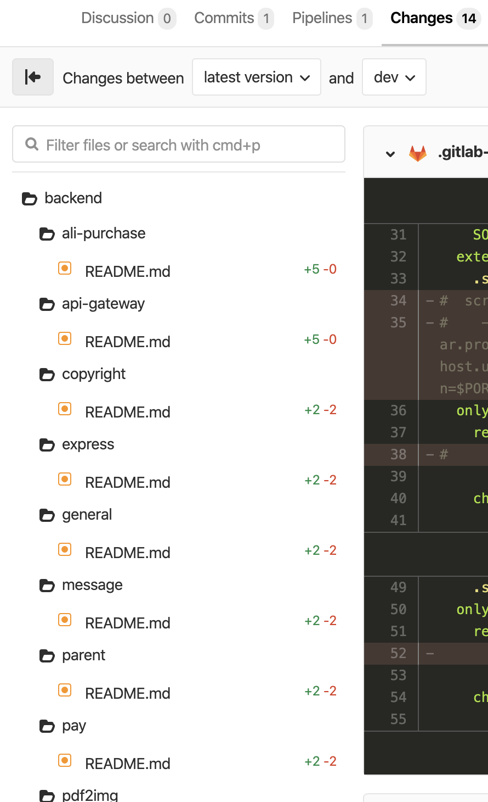

## 自动触发CI流程

pipeline详情

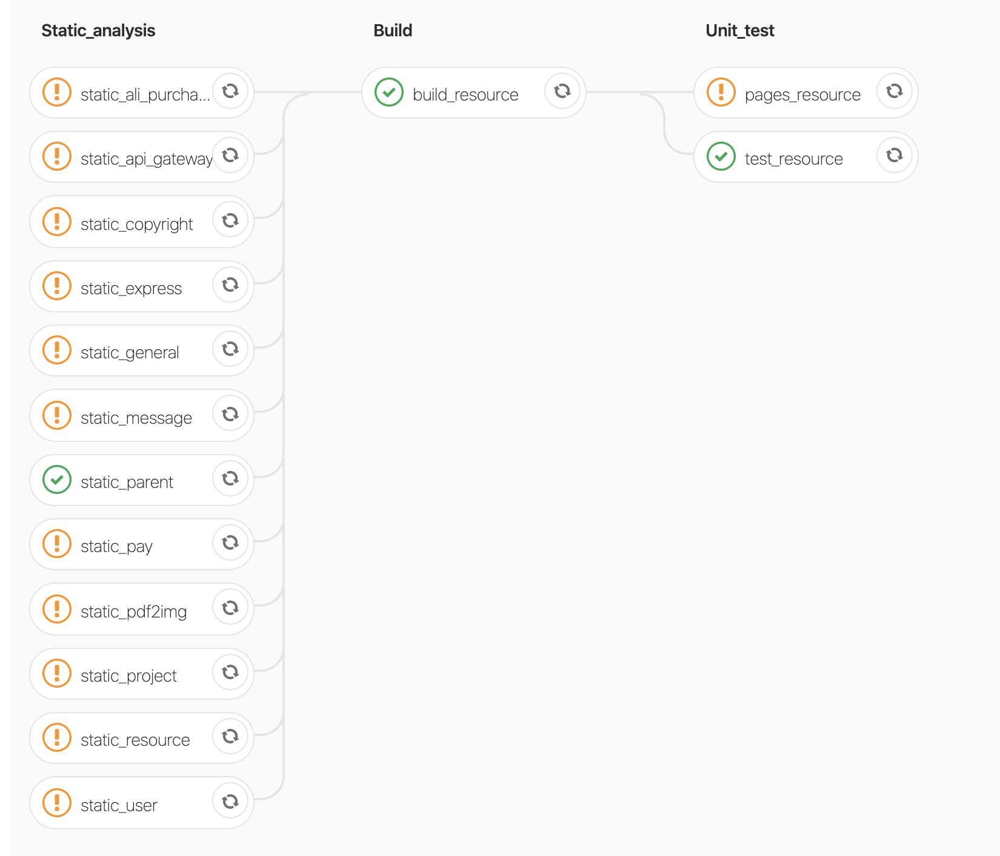

3.3 输出报告


### 覆盖率详情静态页面报告

1)报告获取

进入gitlab该工程主页；

进入pipeline页；

找到对应的pipeline，点击右侧附件下载按钮，下载静态报告；

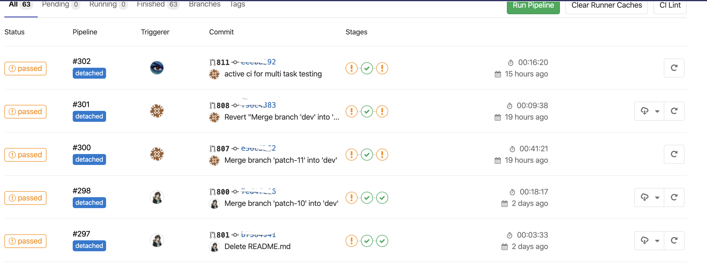

解压下载的附件，通过浏览器打开对应应用路径下的index.html;

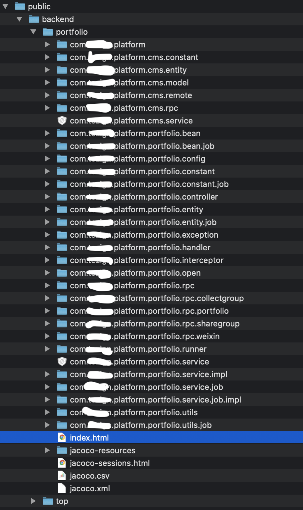

2）报告详情实例 
 
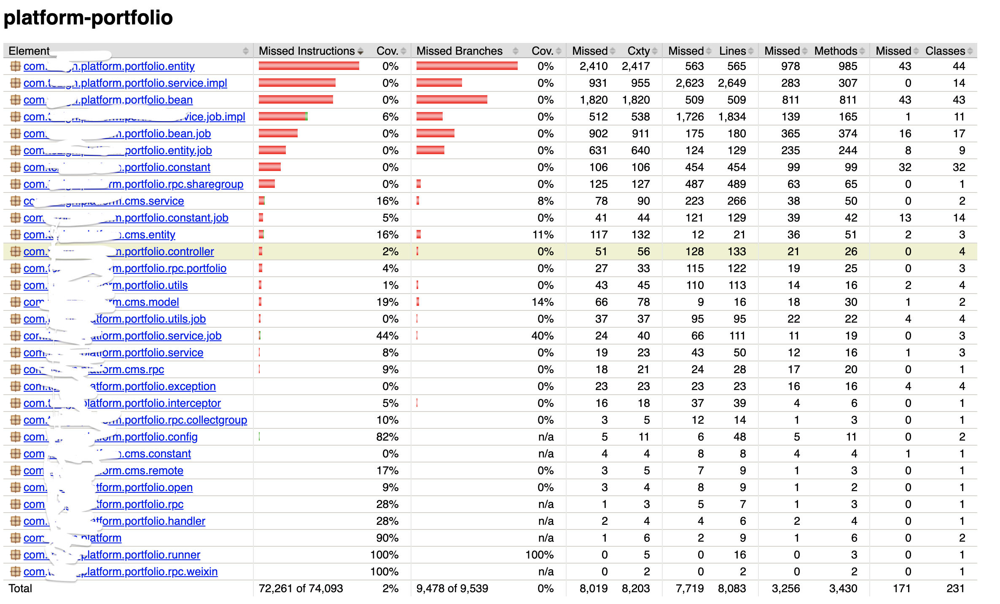

### 覆盖率分析图表


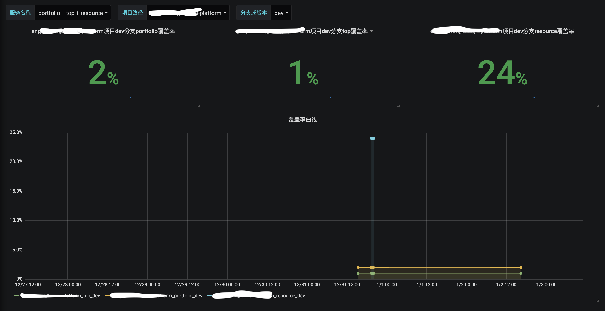

注：Grafana模板见grafana_templates/coverage_dashboard.json。

### 代码质量分析结果


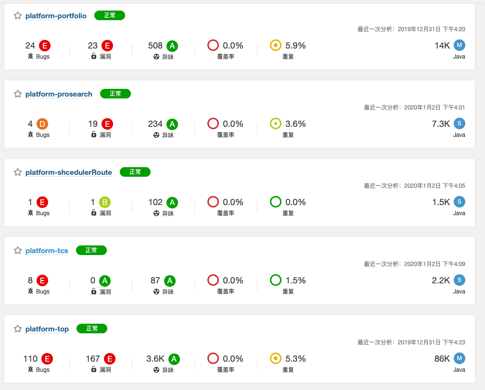

详情

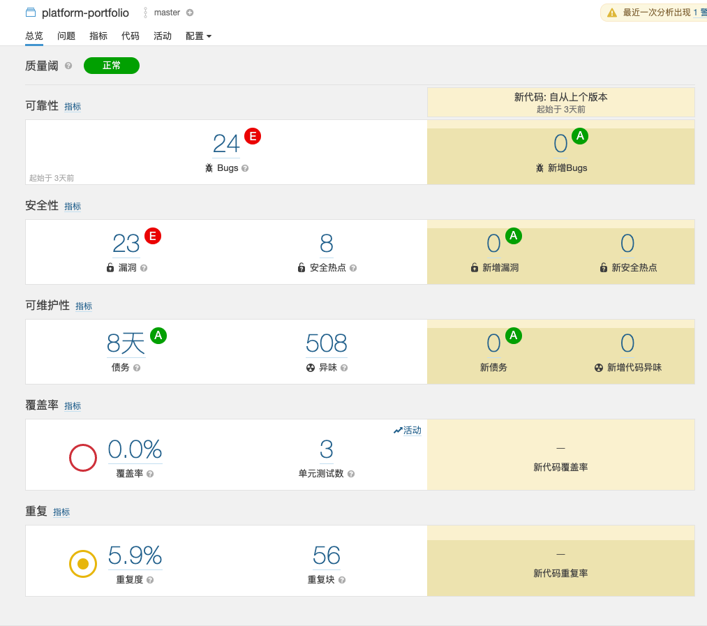
